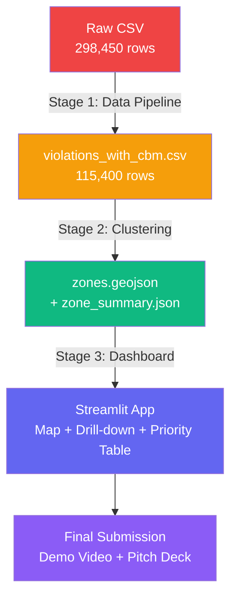
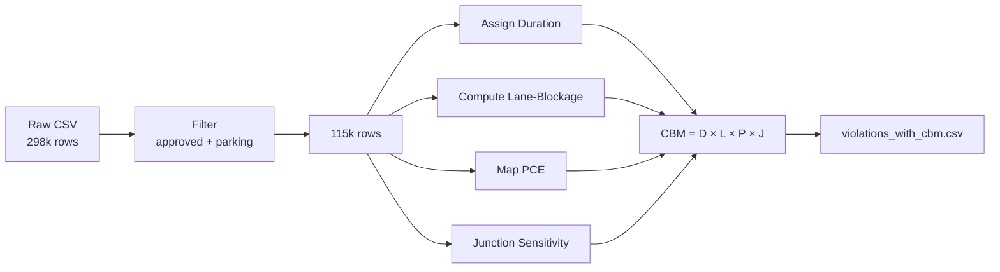
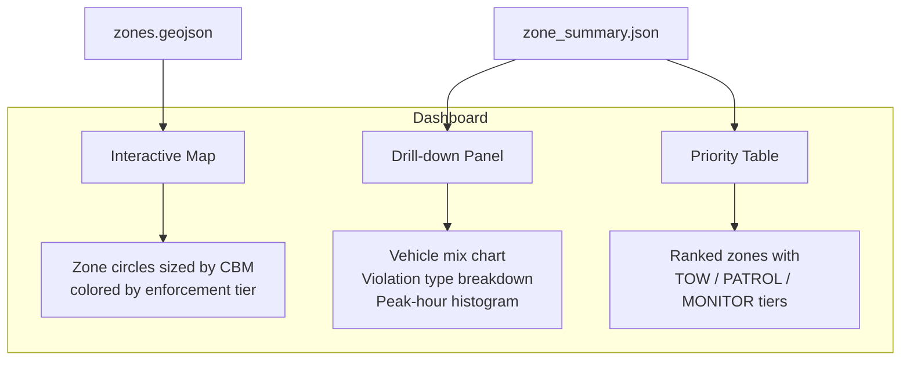

# CurbOps: Parking enforcement intelligence — Full Project Walkthrough

> **Team:** CurbOps: Parking enforcement intelligence  
> **Event:** Gridlock 2.0 Hackathon (1,600+ participants, 6-day build)  
> **Theme:** AI-powered solutions for Bengaluru Traffic Police (BTP) to combat parking-induced congestion  

---

## 1. The Problem We're Solving

Illegal parking in Bengaluru doesn't just break rules — it **destroys road capacity**. A truck double-parked near a signal junction causes far more congestion than a scooter on a footpath at midnight. Yet most teams at Gridlock 2.0 will produce a simple violation-count heatmap that treats every parking ticket equally.

**CurbOps: Parking enforcement intelligence goes deeper.** We answer the hard question:

> *"How badly does this parking event disrupt traffic, and where should enforcement go first?"*

---

## 2. Our Core Innovation: CBM (Capacity-Blockage Minutes)

CBM is a single, explainable metric that quantifies the **real-world traffic damage** of every illegal parking event.

$$\text{CBM} = \text{Duration} \times \text{Lane-Blockage Factor} \times \text{Vehicle Footprint (PCE)} \times \text{Junction Sensitivity}$$

| Factor | What it captures | Example values |
|--------|-----------------|----------------|
| **Duration** (minutes) | How long the vehicle blocked the road | Double-parking → 15 min, Footpath → 60 min |
| **Lane-Blockage Factor** | Severity of the obstruction type | Double-parking → 1.0, Bus-stop → 0.8, Footpath → 0.2 |
| **Vehicle Footprint (PCE)** | Physical size via IRC:106 Passenger Car Equivalent | Truck/Bus → 3.0, Car → 1.0, Scooter → 0.3 |
| **Junction Sensitivity** | Proximity to major junctions (exponential decay) | At junction → 2.0, 100m away → ~1.37, 1km+ → ~1.0 |

> [!TIP]
> **Why CBM wins:** It's physics-informed, every parameter is explainable to a traffic officer, and it produces a single number that directly answers "how much road capacity did this event destroy?"

**CBM range in our dataset:** 3.6 – 217.9 (mean: 13.9)

---

## 3. End-to-End Pipeline Architecture



| Stage | Status | Script | Input → Output |
|-------|--------|--------|----------------|
| **1. Data Pipeline** | ✅ Complete | [build_cbm_dataset.py](file:///e:/GridLock_Hackathon/build_cbm_dataset.py) | Raw CSV → `violations_with_cbm.csv` |
| **2. Clustering** | ✅ Complete | [run_clustering.py](file:///e:/GridLock_Hackathon/run_clustering.py) | `violations_with_cbm.csv` → `zones.geojson` + `zone_summary.json` |
| **3. Dashboard** | ⏳ Next | TBD (Streamlit) | JSON files → Interactive web app |

---

## 4. Stage 1 — Data Pipeline (Complete)

**Script:** [build_cbm_dataset.py](file:///e:/GridLock_Hackathon/build_cbm_dataset.py) (643 lines)

### 4.1 What it does



### 4.2 Key processing decisions

| Step | Challenge | Solution |
|------|-----------|----------|
| **Filtering** | 298k rows include non-parking violations | Filtered to `validation_status='approved'` + parking keywords → 115,400 rows |
| **Duration** | `closed_datetime` is **100% NULL** | Domain-based defaults (e.g., double-parking → 15 min, footpath → 60 min) |
| **Lane-Blockage** | `violation_type` is a JSON array with multiple types | Parsed JSON, mapped each type, kept the **maximum** (worst-case) |
| **PCE** | 22 different raw vehicle type strings | Exact-match lookup table + keyword fallback, based on IRC:106-2015 |
| **Junction Sensitivity** | ~48% of rows have "No Junction" | Used MapmyIndia reverse-geocode API (OAuth2) + cached results in [mmi_cache.json](file:///e:/GridLock_Hackathon/dataset/mmi_cache.json) |

### 4.3 Output columns

The enriched CSV ([violations_with_cbm.csv](file:///e:/GridLock_Hackathon/dataset/violations_with_cbm.csv)) contains these key columns:

```
id, latitude, longitude, vehicle_type, violation_type, offence_code,
created_datetime, police_station, junction_name, validation_status,
lane_blockage_factor, duration_min, pce, junction_distance_m,
junction_sensitivity, cbm
```

### 4.4 Verification results

- ✅ Zero nulls in output
- ✅ Zero duplicates
- ✅ CBM range: 3.6 – 217.9 (mean 13.9)
- ✅ Top stations by total CBM match known Bengaluru congestion zones:
  - Upparpet: 229k CBM
  - HAL Old Airport: 126k CBM
  - Shivajinagar: 117k CBM

---

## 5. Stage 2 — Clustering Pipeline (Complete)

**Script:** [run_clustering.py](file:///e:/GridLock_Hackathon/run_clustering.py) (495 lines)

### 5.1 Purpose

Transform 115,400 individual violations into **operational enforcement zones** — spatial clusters that BTP officers can actually patrol.

### 5.1.1 Actual Results

| Metric | Value |
|--------|-------|
| **Clusters found** | 2,021 |
| **Violations assigned** | 112,501 (97.5%) |
| **Noise reassigned** | 29,653 (of 32,552 noise points) |
| **Noise discarded** | 2,899 (2.5%) |
| **Runtime** | 31.5 seconds |

**Top 5 zones by CBM:**

| Zone | Dominant Junction | Station | Window | CBM Sum |
|------|------------------|---------|--------|---------|
| 1983 | BTP040 - Elite Junction | Upparpet | 07:00-08:00 | 15,291.65 |
| 284 | No Junction | Mahadevapura | 07:00-08:00 | 14,359.80 |
| 1927 | BTP057 - Anand Rao Junction | Upparpet | 19:00-20:00 | 12,894.96 |
| 1728 | BTP083 - AS Char Street | Chamarajpet | 07:00-08:00 | 12,365.36 |
| 1558 | BTP211 - Central Street Junction | Shivajinagar | 09:00-10:00 | 10,868.94 |

### 5.2 Algorithm: HDBSCAN

We use **HDBSCAN** (Hierarchical Density-Based Spatial Clustering of Applications with Noise) because:

- ✅ **No pre-defined cluster count** — discovers zones naturally from data density
- ✅ **Haversine metric** — works directly with lat/lon on a sphere (no projection errors)
- ✅ **Handles noise** — outlier violations don't pollute zone boundaries
- ✅ **Variable-density clusters** — finds both tight downtown clusters and spread-out suburban ones

### 5.3 Pipeline stages

The script runs 6 sequential stages:

#### Stage 1: Load Data — [load_data()](file:///e:/GridLock_Hackathon/run_clustering.py#L106-L123)
Reads `violations_with_cbm.csv`, drops any rows with missing lat/lon (safety net).

#### Stage 2: HDBSCAN Clustering — [run_hdbscan()](file:///e:/GridLock_Hackathon/run_clustering.py#L126-L165)
- Converts lat/lon to **radians** (required by Haversine metric)
- Runs HDBSCAN with tunable parameters
- Assigns integer `zone_id` to each violation (`-1` = noise)
- Raises `ValueError` if 0 clusters found

#### Stage 3: Noise Reassignment — [reassign_noise()](file:///e:/GridLock_Hackathon/run_clustering.py#L168-L224)
- Computes centroid of each cluster
- For each noise point, finds nearest cluster centroid using **vectorized Haversine**
- If distance ≤ 200m → adopts the point into that cluster
- Remaining noise points are discarded from zone aggregation

#### Stage 4: Zone Metrics — [compute_zone_metrics()](file:///e:/GridLock_Hackathon/run_clustering.py#L227-L342)
Groups by `zone_id` and computes **14 metrics** per zone (see table below).

#### Stage 5: GeoJSON Output — [write_geojson()](file:///e:/GridLock_Hackathon/run_clustering.py#L345-L380)
Writes `zones.geojson` — a FeatureCollection with Point geometries at zone centroids.

#### Stage 6: JSON Output — [write_zone_summary()](file:///e:/GridLock_Hackathon/run_clustering.py#L383-L392)
Writes `zone_summary.json` — a sorted JSON array for the dashboard priority table.

### 5.4 Tunable constants

All parameters are declared at the [top of the script](file:///e:/GridLock_Hackathon/run_clustering.py#L28-L60):

```python
MIN_CLUSTER_SIZE = 10              # minimum points to form a dense region
CLUSTER_SELECTION_EPSILON = 0.0    # no forced merging; natural density clusters
NOISE_REASSIGN_THRESHOLD_M = 200   # max distance to adopt a noise point
LOW_CONFIDENCE_THRESHOLD = 5       # zones with fewer violations get flagged
PEAK_HOURS = {7, 8, 9, 10, 17, 18, 19}  # morning + evening rush
```

> [!WARNING]
> **Epsilon lesson learned:** The original spec used `0.001` rad (~100m comment), but 0.001 radians is actually **~6.4 km** (`0.001 × 6,371,000m`). This collapsed all of Bengaluru into 2 mega-clusters. Setting epsilon to `0.0` lets HDBSCAN find natural density-based clusters, producing 2,021 meaningful zones.

### 5.5 Per-zone metrics computed

| Metric | Computation | Used for |
|--------|-------------|----------|
| `zone_id` | Cluster label (int) | Unique identifier |
| `zone_CBM_sum` | Sum of CBM in zone | **Primary ranking** |
| `violation_count` | Number of violations | Zone size |
| `peak_hour_ratio` | Fraction in peak hours (7–10am, 5–7pm) | Rush-hour severity |
| `recurrence_days` | Unique dates with violations | Persistence indicator |
| `top_vehicle_types` | Top 3 vehicles with counts | Enforcement targeting |
| `top_violation_types` | Top 3 violation types with counts | Violation profile |
| `centroid_lat/lon` | Mean lat/lon of zone | Map placement |
| `dominant_junction` | Most frequent junction (excluding "No Junction") | Location label |
| `police_station` | Most frequent station | Station assignment |
| `recommended_window` | Hour with most violations (e.g., "08:00-09:00") | Patrol scheduling |
| `radius_m` | Max distance from centroid to any point | Zone size on map |
| `priority_score` | `CBM_sum × peak_ratio × log(1 + recurrence_days)` | **Enforcement ranking** |
| `low_confidence` | True if < 5 violations | Data quality flag |

### 5.6 Edge cases handled

| Edge case | Handling |
|-----------|----------|
| 0 clusters produced | `ValueError` raised with parameter tuning suggestion |
| Zone with < 5 violations | Flagged with `low_confidence = True` |
| Missing `created_datetime` | Excluded from time metrics only, kept for all other metrics |
| Mode is "No Junction" | Falls through to next most frequent; if none exists, keeps `"No Junction"` |
| All junction values are NaN | `dominant_junction` set to `"Unknown"` |
| Tied peak hours | Earliest hour is selected |

### 5.7 Output files

**`dataset/zones.geojson`** — GeoJSON FeatureCollection
```json
{
  "type": "FeatureCollection",
  "features": [
    {
      "type": "Feature",
      "geometry": { "type": "Point", "coordinates": [77.5805, 12.9777] },
      "properties": {
        "zone_id": 42,
        "zone_CBM_sum": 15234.56,
        "violation_count": 892,
        "priority_score": 48291.03,
        "radius_m": 312.5,
        ...
      }
    }
  ]
}
```

**`dataset/zone_summary.json`** — Sorted JSON array (same data, flat format)

---

## 6. Stage 3 — Dashboard (Future)

The Streamlit dashboard will consume the two JSON/GeoJSON files and display:



### Enforcement tiers (based on `priority_score` percentiles)

| Tier | Percentile | Action |
|------|-----------|--------|
| 🔴 **TOW** | Top 10% | Deploy tow trucks, heavy fines |
| 🟡 **PATROL** | Next 20% | Regular patrol presence |
| 🟢 **MONITOR** | Bottom 70% | Periodic monitoring |

> [!IMPORTANT]
> The dashboard requires **no further data processing** — it reads the static JSON files directly. This means the live demo has **zero risk of runtime failure**.

---

## 7. Key Files Reference

| File | Location | Description |
|------|----------|-------------|
| [Raw CSV](file:///e:/GridLock_Hackathon/dataset/jan%20to%20may%20police%20violation_anonymized791b166.csv) | `dataset/` | Original BTP dataset (298k rows, 109 MB) |
| [violations_with_cbm.csv](file:///e:/GridLock_Hackathon/dataset/violations_with_cbm.csv) | `dataset/` | Enriched dataset with CBM (115k rows, 49 MB) |
| [mmi_cache.json](file:///e:/GridLock_Hackathon/dataset/mmi_cache.json) | `dataset/` | MapmyIndia API response cache |
| [build_cbm_dataset.py](file:///e:/GridLock_Hackathon/build_cbm_dataset.py) | root | Stage 1: Data pipeline script |
| [run_clustering.py](file:///e:/GridLock_Hackathon/run_clustering.py) | root | Stage 2: Clustering pipeline script |
| [requirements.txt](file:///e:/GridLock_Hackathon/requirements.txt) | root | Python dependencies |
| [Submission PDF](file:///e:/GridLock_Hackathon/CAUSAFLOW_AI_Final_Submission_Draft_Final.pdf) | root | Final pitch document |

---

## 8. How to Run

### Prerequisites
```bash
pip install pandas numpy hdbscan geopandas shapely
```

### Stage 1 — Data Pipeline (already completed)
```bash
python build_cbm_dataset.py
# Output: dataset/violations_with_cbm.csv
```

### Stage 2 — Clustering (ready to run)
```bash
python run_clustering.py
# Output: dataset/zones.geojson + dataset/zone_summary.json
```

### Stage 3 — Dashboard (to be built)
```bash
streamlit run dashboard.py
```

---

## 9. Key Terminology Glossary

| Term | Definition |
|------|-----------|
| **CBM** | Capacity-Blockage Minutes — our core impact metric quantifying road capacity destroyed by illegal parking |
| **PCE** | Passenger Car Equivalent — standardized vehicle size unit from IRC:106-2015 |
| **Zone** | A spatial cluster of violations that forms an actionable enforcement hotspot |
| **Priority Score** | `zone_CBM_sum × peak_hour_ratio × log(1 + recurrence_days)` — the single number that ranks zones |
| **Enforcement Tier** | TOW (top 10%), PATROL (next 20%), MONITOR (rest) — based on priority_score percentiles |
| **HDBSCAN** | Hierarchical Density-Based Spatial Clustering — discovers variable-density clusters without preset count |
| **Haversine** | Great-circle distance formula for points on a sphere (lat/lon → metres) |
| **Junction Sensitivity** | Exponential proximity factor: `1 + exp(-distance_m / 100)` — amplifies CBM near intersections |

---

## 10. Design Principles

> [!NOTE]
> These principles apply to **every** script, metric, and output in the project.

1. **Explainability first** — Every formula and parameter can be explained in plain language to a traffic officer
2. **Constants at the top** — All thresholds, weights, and distances are tunable and documented
3. **Zero-null outputs** — Every output file is complete and ready for the next stage without manual fixes
4. **Pre-computed safety** — The live demo runs on static files; zero risk of API failures or runtime errors
5. **Defensible metrics** — CBM is grounded in traffic engineering standards (IRC:106, Haversine geometry)
